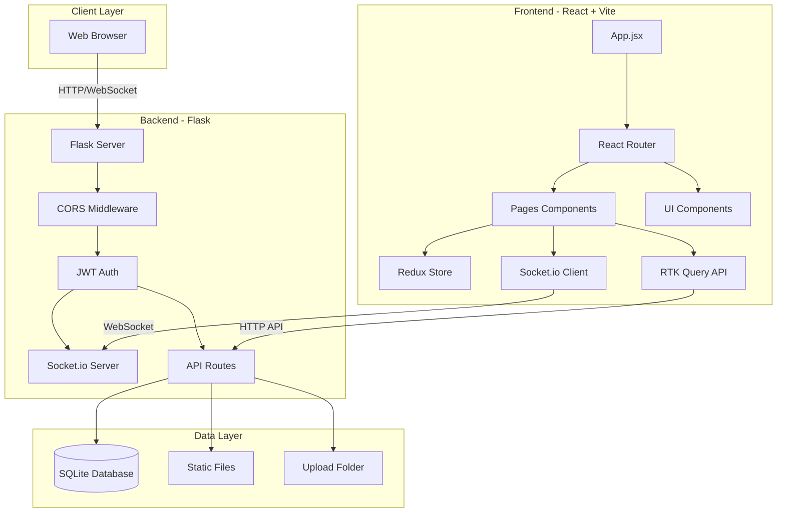
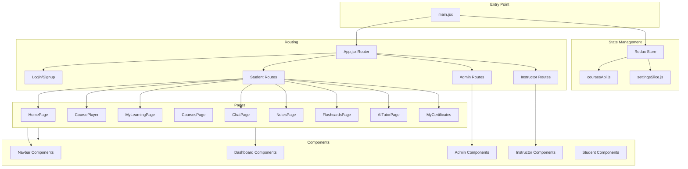
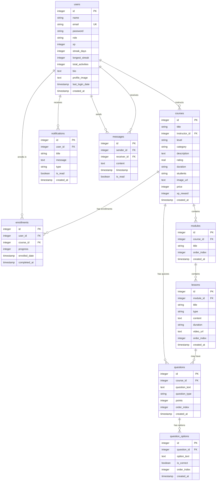
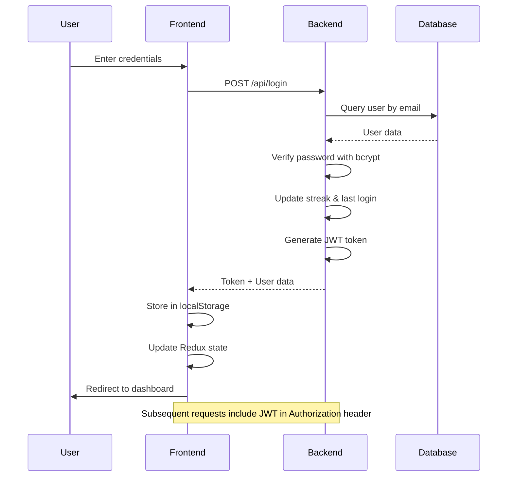
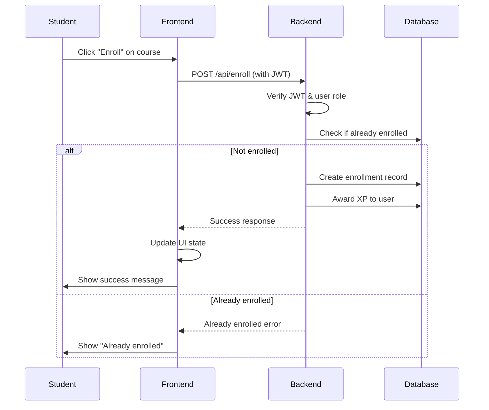
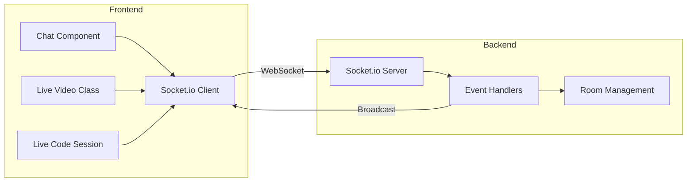
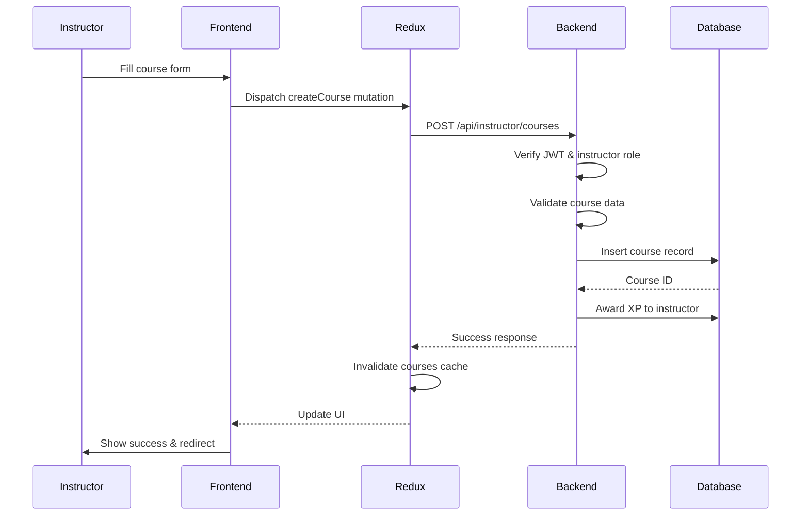

# MysteryPath Architecture Diagram

## System Overview

MysteryPath (also known as learnFlow) is a full-stack e-learning platform built with React (frontend) and Flask (backend), featuring role-based access control, real-time communication, and gamification elements.

---

## High-Level Architecture



---

## Frontend Architecture



---

## Backend Architecture

```mermaid
graph TB
    subgraph "Main Application"
        AppPy[app.py]
        Config[config.py]
        Database[database.py]
    end
    
    subgraph "API Routes"
        AuthRoutes[auth.py]
        InstructorRoutes[instructor_routes.py]
        CoursesRoutes[courses.js]
        EnrollmentRoutes[enrollment.js]
    end
    
    subgraph "Middleware"
        CORS[CORS]
        Bcrypt[Flask-Bcrypt]
        JWT[PyJWT]
        SocketIO[Flask-SocketIO]
    end
    
    subgraph "Database Tables"
        Users[users]
        Courses[courses]
        Enrollments[enrollments]
        Modules[modules]
        Lessons[lessons]
        Notifications[notifications]
        Messages[messages]
        PasswordResets[password_resets]
        Settings[settings]
        Questions[questions]
        QuestionOptions[question_options]
    end
    
    AppPy --> Config
    AppPy --> Database
    AppPy --> Middleware
    AppPy --> API Routes
    
    AuthRoutes --> Users
    AuthRoutes --> PasswordResets
    
    InstructorRoutes --> Courses
    InstructorRoutes --> Users
    
    CoursesRoutes --> Courses
    CoursesRoutes --> Modules
    CoursesRoutes --> Lessons
    
    EnrollmentRoutes --> Enrollments
    EnrollmentRoutes --> Courses
    
    Middleware --> Database
```

---

## Database Schema



---

## Authentication Flow



---

## Course Enrollment Flow



---

## Real-time Communication (Socket.IO)



---

## Role-Based Access Control

```mermaid
graph TB
    subgraph "User Roles"
        Admin[Admin]
        Instructor[Instructor]
        Student[Student]
    end
    
    subgraph "Admin Features"
        AdminDashboard[Admin Dashboard]
        ManageUsers[Manage Users]
        ManageCourses[Manage All Courses]
        ManageInstructors[Manage Instructors]
        SystemSettings[System Settings]
        SendNotifications[Send Notifications]
        RevenueAnalytics[Revenue Analytics]
    end
    
    subgraph "Instructor Features"
        InstructorDashboard[Instructor Dashboard]
        CreateCourses[Create/Edit Courses]
        ManageStudents[Manage Students]
        LiveClasses[Live Video Classes]
        CodeSessions[Live Code Sessions]
        Analytics[Course Analytics]
    end
    
    subgraph "Student Features"
        BrowseCourses[Browse Courses]
        Enroll[Enroll in Courses]
        CoursePlayer[Course Player]
        Chat[Chat/Messaging]
        Notes[Notes]
        Flashcards[Flashcards]
        AITutor[AI Tutor]
        Certificates[Certificates]
        Achievements[Achievements]
    end
    
    Admin --> AdminDashboard
    Admin --> ManageUsers
    Admin --> ManageCourses
    Admin --> ManageInstructors
    Admin --> SystemSettings
    Admin --> SendNotifications
    Admin --> RevenueAnalytics
    
    Instructor --> InstructorDashboard
    Instructor --> CreateCourses
    Instructor --> ManageStudents
    Instructor --> LiveClasses
    Instructor --> CodeSessions
    Instructor --> Analytics
    
    Student --> BrowseCourses
    Student --> Enroll
    Student --> CoursePlayer
    Student --> Chat
    Student --> Notes
    Student --> Flashcards
    Student --> AITutor
    Student --> Certificates
    Student --> Achievements
```



---

## API Endpoints Structure

### Authentication Routes (`/api/auth`)
- `POST /api/register` - User registration
- `POST /api/login` - User login
- `GET /api/profile` - Get user profile
- `POST /api/update-activity` - Update user activity/XP
- `POST /api/forgot-password` - Initiate password reset
- `POST /api/verify-reset-code` - Verify reset code
- `POST /api/reset-password` - Reset password
- `POST /api/complete-registration` - Complete instructor registration

### Instructor Routes (`/api/instructor`)
- `GET /instructor/stats` - Get instructor statistics
- `GET /instructor/courses` - Get instructor's courses
- `POST /instructor/courses` - Create new course
- `PUT /instructor/courses/:id` - Update course
- `DELETE /instructor/courses/:id` - Delete course

### Student Routes (`/api/student`)
- `GET /student/courses/:id/structure` - Get course structure
- `GET /student/enrolled-count` - Get enrolled courses count
- `POST /enroll` - Enroll in course

### Admin Routes (`/api/admin`)
- `GET /admin/stats` - Get platform statistics
- `GET /admin/users` - Get all users
- `GET /admin/all-courses` - Get all courses
- `PUT /admin/courses/:id` - Update any course
- `DELETE /admin/courses/:id` - Delete any course
- `POST /admin/settings/logo` - Update site logo

### General Routes
- `GET /api/settings/logo` - Get site logo
- `POST /api/upload/image` - Upload course image
- `GET /api/test` - Test endpoint

---

## Technology Stack

### Frontend
- **Framework**: React 18.2.0
- **Build Tool**: Vite 5.4.21
- **State Management**: Redux Toolkit 2.12.0
- **API Client**: RTK Query (Redux Toolkit Query)
- **Routing**: React Router DOM 6.30.4
- **Styling**: TailwindCSS 3.4.1
- **Icons**: Lucide React 1.17.0
- **Real-time**: Socket.io Client 4.8.3
- **HTTP Client**: Axios 1.17.0
- **PDF Generation**: jsPDF 4.2.1
- **Video Player**: React Player 2.14.1
- **Charts**: Recharts 2.12.0
- **Code Editor**: Monaco Editor 4.6.0
- **MediaPipe**: Selfie Segmentation 0.1.1675465747

### Backend
- **Framework**: Flask 2.3.3
- **Database**: SQLite
- **Authentication**: Flask-Bcrypt 1.0.1, PyJWT 2.8.0
- **CORS**: Flask-CORS 4.0.0
- **Real-time**: Flask-SocketIO
- **Async Mode**: Eventlet (if available) or Threading

### Development Tools
- **Package Manager**: npm
- **Linting**: ESLint
- **PostCSS**: Autoprefixer 10.4.18

---

## Key Features

1. **Multi-Role Authentication**: Admin, Instructor, Student roles with JWT-based authentication
2. **Course Management**: Create, edit, delete courses with modules and lessons
3. **Enrollment System**: Students can enroll in courses and track progress
4. **Gamification**: XP system, streak tracking, achievements
5. **Real-time Features**: Live video classes, live code sessions, chat/messaging
6. **Content Types**: Video lessons, text content, quizzes
7. **Learning Tools**: Notes, flashcards, AI tutor
8. **Certificates**: Generate certificates upon course completion
9. **Admin Dashboard**: Platform analytics, user management, system settings
10. **Instructor Analytics**: Track student progress, course performance

---

## File Structure

```
MysteryPath/
├── app.py                      # Main Flask application (root)
├── package.json                # Frontend dependencies
├── vite.config.js              # Vite configuration
├── tailwind.config.cjs         # TailwindCSS configuration
├── index.html                  # HTML entry point
├── .env                        # Environment variables
├── elearning.db                # SQLite database
│
├── backend/
│   ├── app.py                  # Modular Flask app
│   ├── config.py               # Configuration
│   ├── database.py             # Database initialization
│   ├── requirements.txt        # Python dependencies
│   ├── routes/
│   │   ├── auth.py             # Authentication routes
│   │   ├── instructor_routes.py # Instructor routes
│   │   ├── courses.js          # Course routes
│   │   └── enrollment.js       # Enrollment routes
│   ├── middleware/             # Custom middleware
│   ├── static/                 # Static files
│   └── venv/                   # Python virtual environment
│
├── src/
│   ├── main.jsx                # React entry point
│   ├── App.jsx                 # Main React component
│   ├── store.js                # Redux store configuration
│   ├── coursesApi.js           # RTK Query API configuration
│   ├── index.css               # Global styles
│   ├── App.css                 # App styles
│   │
│   ├── pages/                  # Page components
│   │   ├── HomePage.jsx
│   │   ├── CoursePlayer.jsx
│   │   ├── MyLearningPage.jsx
│   │   ├── CoursesPage.jsx
│   │   ├── ChatPage.jsx
│   │   ├── NotesPage.jsx
│   │   ├── FlashcardsPage.jsx
│   │   ├── AITutorPage.jsx
│   │   ├── AchievementsPage.jsx
│   │   ├── MyCertificates.jsx
│   │   └── ...
│   │
│   ├── components/             # Reusable components
│   │   ├── Admin/              # Admin-specific components
│   │   │   ├── AdminDashboard.jsx
│   │   │   ├── ManageUsers.jsx
│   │   │   ├── ManageCourses.jsx
│   │   │   ├── SystemSettings.jsx
│   │   │   └── ...
│   │   ├── Instructor/         # Instructor-specific components
│   │   │   ├── InstructorDashboard.jsx
│   │   │   ├── ManageCourses.jsx
│   │   │   ├── LiveVideoClass.jsx
│   │   │   ├── LiveCodeSession.jsx
│   │   │   └── ...
│   │   ├── Navbar.jsx
│   │   ├── StudentNavbar.jsx
│   │   ├── AdminNavbar.jsx
│   │   ├── InstructorNavbar.jsx
│   │   ├── Dashboard.jsx
│   │   ├── Chat.jsx
│   │   ├── Profile.jsx
│   │   └── ...
│   │
│   ├── assets/                 # Static assets
│   └── config/                 # Configuration files
│
├── public/                     # Public static files
├── logs/                       # Application logs
└── node_modules/               # npm dependencies
```

---

## Data Flow Example: Course Creation



---

## Security Considerations

1. **JWT Authentication**: All protected routes require valid JWT token
2. **Password Hashing**: Bcrypt for secure password storage
3. **CORS**: Configured for specific origins only
4. **Role-Based Access**: Middleware checks user roles before granting access
5. **SQL Injection Prevention**: Parameterized queries throughout
6. **File Upload Validation**: File type and size restrictions
7. **Rate Limiting**: Password reset attempts limited
8. **Environment Variables**: Sensitive data stored in .env file

---

## Deployment Considerations

1. **Database**: SQLite is suitable for development; consider PostgreSQL for production
2. **Secret Key**: Must be changed from default in production
3. **CORS Origins**: Update ALLOWED_ORIGINS for production domain
4. **File Storage**: Consider cloud storage (S3) for uploaded files in production
5. **Logging**: Rotating file handler configured for error logs
6. **Socket.IO**: Ensure proper WebSocket support in production environment
7. **Frontend**: Build with `npm run build` for production deployment
8. **Backend**: Use production WSGI server (e.g., Gunicorn) instead of Flask dev server

---

## Future Enhancement Opportunities

1. **Payment Integration**: Stripe/PayPal for paid courses
2. **Video Streaming**: Integrate dedicated video hosting (Vimeo, AWS)
3. **Email Service**: Real email notifications (SendGrid, AWS SES)
4. **Advanced Analytics**: More detailed learning analytics
5. **Mobile App**: React Native mobile application
6. **API Documentation**: Swagger/OpenAPI documentation
7. **Testing**: Unit and integration tests
8. **CI/CD**: Automated testing and deployment pipeline
9. **Monitoring**: Application performance monitoring
10. **Scalability**: Move to microservices architecture if needed
